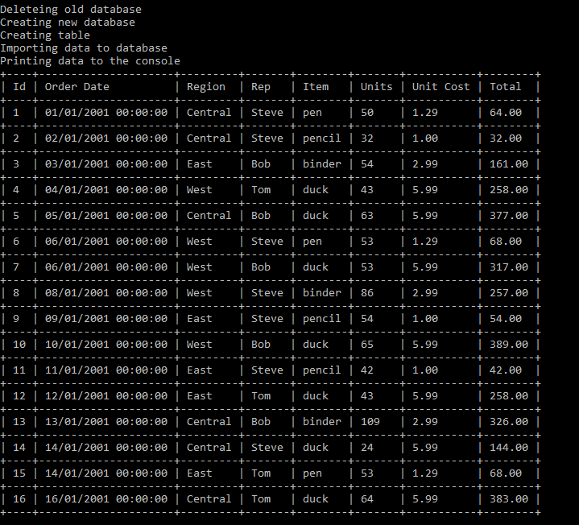

# Excel-Reader

Ninth application in a series for learning .net. 

On startup application deletes old database, creates a new one, creates a table, imports data from excel sheet and prints it in console.

## Requirements: 
 - [x] This is an application that will read data from an Excel spreadsheet into a database
 - [x] When the application starts, it should delete the database if it exists, create a new one, create all tables, read from Excel, seed into the database.
 - [x] You need to use EPPlus package
 - [x] You shouldn't read into Json first.
 - [x] You can use SQLite or SQL Server (or MySQL if you're using a Mac)
 - [x] Once the database is populated, you'll fetch data from it and show it in the console.
 - [x] You don't need any user input
 - [x] You should print messages to the console letting the user know what the app is doing at that moment (i.e. reading from excel; creating tables, etc)
 - [x] The application will be written for a known table, you don't need to make it dynamic.

## Features
- Category Menu
  - Below image shows a table of acquisitions for a certain period with adequate amount of acquired ducks
  - 

- Reporting is done for all the tables with different information
  - "ConsoleTableExt" library was used for table display 

## Tech stack:
- ConsoleTableExt
- EPPlus
- SqlClient
- SqlDataReader
- Sql
- .net 6.0

Special thanks to [Cappuccinocodes](https://github.com/cappuccinocodes) for help and advice.
